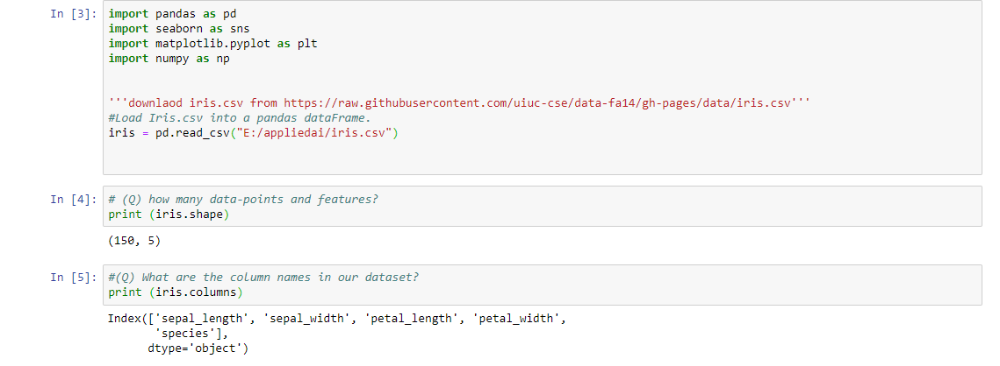
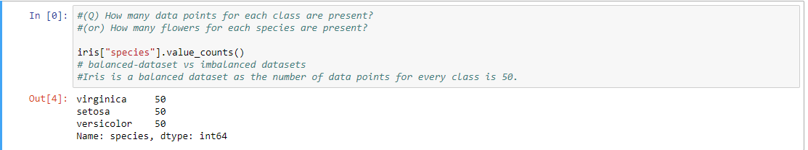

# Basics_of_dataScience_Iris_dataset
Key points to remember about EDA (iris dataset).

Data Science is an art of extracting knowledge from data using statistics, various analytics etc.

Data Analysis                                                                                                                             
             -->Involves 
                         1.Business problem                                                                                    
                         2.Data Acquisition(Getting the data)                                                                       
                         3.Data Wrangling(Cleaning or preprocessing)                                                   
                         4.Exploratory Data Analysis(Explore, select sutiable model)                     
                         5.Data exploration(build model)
                         6.prediction
             With an exampl:
  1.Problem:- To predict weather a given flower belongs to one of the three types of iris flower family (setosa, verginica, versicolor).                                                                                                                                               2.Data Acquisition                                                                                                                                 Here we already have iris data set.                                                                                                       Iris data set was ceated by Fisher in 1936. These days, it got a lot of fame.                                                               
           Here, from the shape of the data set, we can say that there are 150 rows and 5 columns in the dataset.
           
           
           Here we have 50 items of setosa, 50 items of verginica, 50 items of versicolor.                                                
           So, we have structured data set.                                                                                               
           If the data set have items in the ratio like 50,15,85 then the data is said to be unstructured, which will lead to Over fitting of data.   Then our model will learn more about versicolor(85) and less about verginica(15) --->underfitting. 
        

